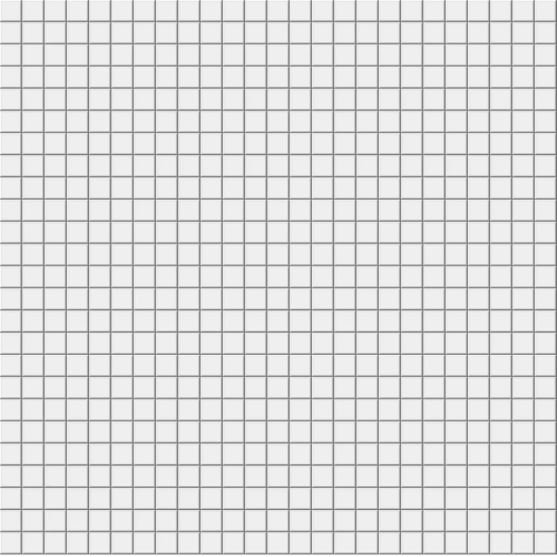

# Implementation of the A Star algorithm using Python

## Introduction

In this project I use **tKinter** package which is included in the standard python library in order to create an implementation  

of the A Star path search algorithm. This algorithm uses a heuristic function and takes into account the cost 

of every node. It combines  this two values and decides which path to follow. At the end it always finds

the best path from start to finish and by saying best path we mean the path with the least cost.

## Implementation

My version of the algorithms implementation consists of a 25 x 25  grid where every square represents and one step. The 

cost from one step to another is always one and the available moves are up/down , left/right and diagonal. The

heuristic function used it this example is square Manhattan-Distance.

>  **Manhatan Distance = | x1 - x2 | + | y1 - y2 |**

My implementation of the algorithm is based in the pseudocode found in the wikipedias page for the A* Algorithm.
 
You can find the pseudocode [here](https://en.wikipedia.org/wiki/A*_search_algorithm)

## How the end result looks

## How to use it

When them program starts a pop up window appears with the following instructions:

- Step 1: Select starting point

- Step 2: Select end point

- Step 3: Select Obstacles

Click and hover.Then click again to stop

- Step 4: Press Enter to start

- Step 5: Press R to restart

>  Note: Selecting obstacles is not necessary you can just select start and goal and press enter to begin the algorithm 
